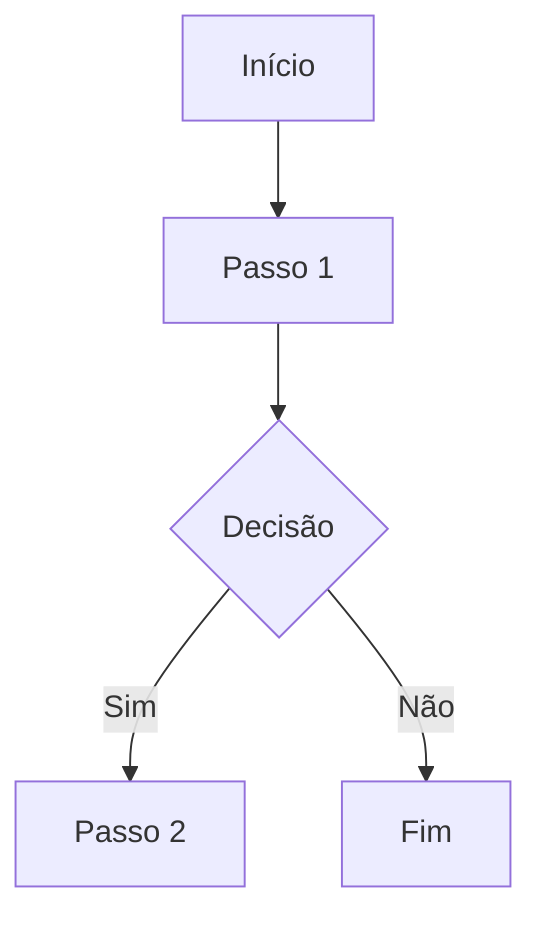

<!-- Títulos -->
# Título para definir o nome do projeto
## Títulos de termos mais genéricos
### Tipo inteiro
#### Algo mais específico de inteiros
##### Algo mais específico de inteiros.
###### Algo mais específico de inteiros....

***

<!-- Quebra de linha e comentários -->
meu nome é Arthur  
meu segundo nome é Felipe
<br><br><br>
meu nome é Arthur <br>
meu segundo nome é Felipe

---

<!-- Ênfase em palavras -->
*itálico* ou _itálico_ <br>
**negrito** ou __negrito__ <br>
~~riscado~~ <br>
**Meu nome é Arthur**<br>
**_negrito e itálico_** ou _**negrito e itálico**_ <br>
~~**_negrito, itálico e riscado_**~~<br>

___

<!-- Listas -->
- Item 1
- Item 2
  - Subitem
    - Sub-Subitem
      - Fim.     

* Item 1
* Item 2

1. Item 1  
    1. Subitem
    2. sddddd  
2. Item 2 
4. asdasd

___

<!-- Links -->
[ir para o google](https://google.com)<br><br>
[google](https://google.com "Clique aqui para ir para o site do google.") <br><br>

***

<!-- Imagens

 -->


<!-- Códigos inline -->
```java
    System.out.println("Olá mundo!");
```

```java
public class HelloWord{
  public static void main (String[] args){
    System.out.println("Olá mundo!");
  }
}
```
---

<!-- Citações -->
> isso é uma citação

>> isso é uma sub-citação

***

<!-- Tabelas -->
| Nome | Idade | Cidade | Estado |
|------|-------|--------|--------|
| Maria | 35 | São Paulo | SP |
| João | 55 | Rio de Janeiro | RJ |
| José | 80 | Campina Grande | PB |

***

<!-- Checklist -->
- [x] tela de login
- [ ] tela de cadastro
- [X] tela de .......

***

:musical_note:

### Skills


mongoDB


***

<details>
  <summary>Ver mais</summary>
  <br>
  texto puro.

    texto na caixa.

  `texto exemplo`

  ```java
    System.out.prinln("Olá mundo!");
  ```
</details>

***




[](https://www.udemy.com)


